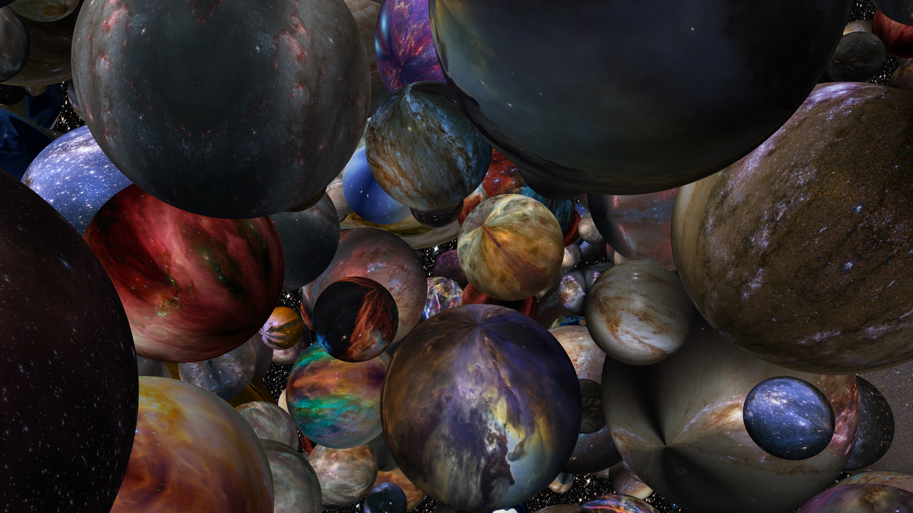
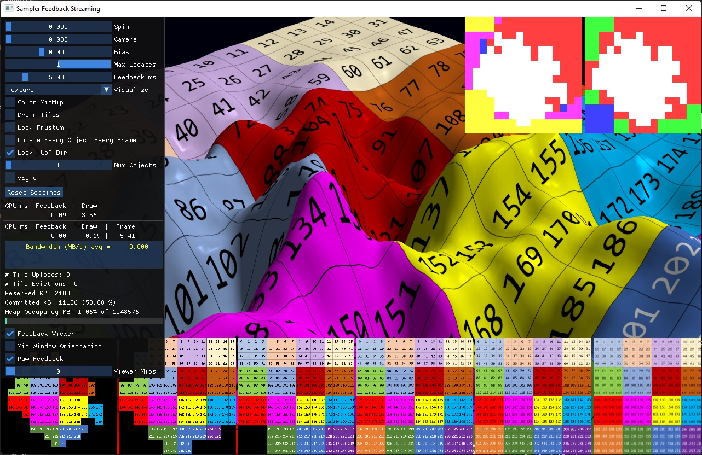
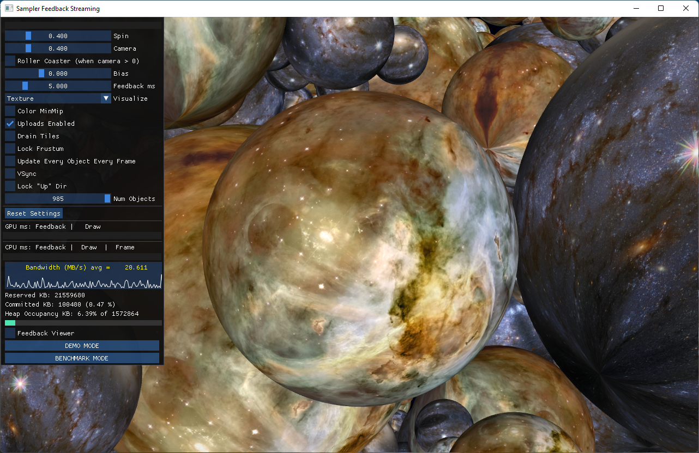
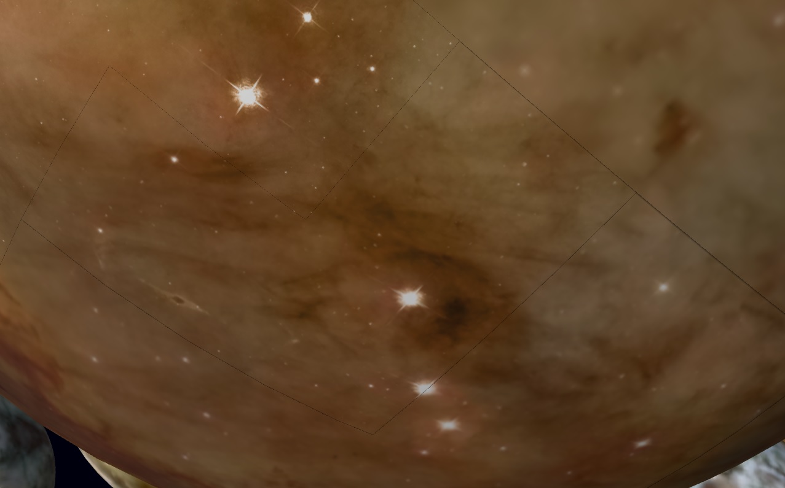

# Sampler Feedback Streaming

This repository contains a demo of `DirectX12 Sampler Feedback Streaming`, a technique using [DirectX12 Sampler Feedback](https://microsoft.github.io/DirectX-Specs/d3d/SamplerFeedback.html) to guide loading of tiles of a reserved resource on-demand per-frame. This allows scenes containing 100s of GBs of resources to be drawn using much less physical memory. The scene below uses just ~200MB of a 1GB heap, despite over 350GB of total texture resources.

Sampler Feedback is supported in hardware on Intel Iris Xe Graphics, as can be found in 11th Generation Intel&reg; Core&trade; processors.

Textures derived from [Hubble Images](https://www.nasa.gov/mission_pages/hubble/multimedia/index.html), see the [Hubble Copyright](https://hubblesite.org/copyright)

## License

Copyright 2021 Intel Corporation

Permission is hereby granted, free of charge, to any person obtaining a copy of
this software and associated documentation files (the "Software"), to deal in
the Software without restriction, including without limitation the rights to
use, copy, modify, merge, publish, distribute, sublicense, and/or sell copies
of the Software, and to permit persons to whom the Software is furnished to do
so, subject to the following conditions:

The above copyright notice and this permission notice shall be included in all
copies or substantial portions of the Software.

THE SOFTWARE IS PROVIDED "AS IS", WITHOUT WARRANTY OF ANY KIND, EXPRESS OR
IMPLIED, INCLUDING BUT NOT LIMITED TO THE WARRANTIES OF MERCHANTABILITY,
FITNESS FOR A PARTICULAR PURPOSE AND NONINFRINGEMENT. IN NO EVENT SHALL THE
AUTHORS OR COPYRIGHT HOLDERS BE LIABLE FOR ANY CLAIM, DAMAGES OR OTHER
LIABILITY, WHETHER IN AN ACTION OF CONTRACT, TORT OR OTHERWISE, ARISING FROM,
OUT OF OR IN CONNECTION WITH THE SOFTWARE OR THE USE OR OTHER DEALINGS IN THE
SOFTWARE.

## Requirements

The demo requires at least Windows 10 version 19041 and a GPU with Sampler Feedback Support.

Intel Iris Xe Graphics, as can be found in 11th Generation Intel&reg; Core&trade; processors, require ***at least*** BETA driver [30.0.100.9667](https://downloadcenter.intel.com/product/80939/Graphics) or later.

Note this repository does not contain the textures shown above, which total over 13GB. A link to these textures will hopefully be provided soon. Test textures are provided, as is a mechanism to convert from BCx format DDS files into the custom .XET format. UPDATE: The first "release" package (labeled "1") contains a .zip with a few hi-res textures.

This repository will be updated When DirectStorage for Windows&reg; becomes available.

## Build Instructions

Download the source. Build the solution file with Visual Studio 2019.

## Running

All executables and .bat files will be found in the x64/Release or x64/Debug directories.

By default, the application starts looking at a single object, "terrain", which allows for exploring sampler feedback streaming.

    c:\SamplerFeedbackStreaming\x64\Release> expanse.exe

There is a batch file, demo.bat, which starts up in a more interesting state:

    c:\SamplerFeedbackStreaming\x64\Release> demo.bat

The textures in the first "release" package, hubble-16k.zip, work with "demo-hubble.bat". Make sure the mediadir in the batch file is set properly, or override it on the command line as follows:

    c:\SamplerFeedbackStreaming\x64\Release> demo-hubble.bat -mediadir c:\hubble-16k

There is also a batch file "nvidia.bat". For some hardware, it was observed that the performance of [UpdateTileMappings](https://docs.microsoft.com/en-us/windows/win32/api/d3d12/nf-d3d12-id3d12commandqueue-updatetilemappings) impacted overall throughput *unless* the heap size was 32MB. One workaround is to create many 32MB heaps and distribute the resources across them.

## Keyboard controls

There are a lot of keyboard controls - a function of giving many demos:

* `qwe / asd` : strafe left, forward, strafe right / rotate left, back, rotate right
* `z c` : levitate up and down
* `x` : toggles "up lock". When hovering over the "terrain" object, locking the up direction "feels right" with mouse navigation. Otherwise, it should be turned off.
* `v b` : rotate around the look direction (z axis)
* `arrow keys` : rotate left/right, pitch down/up
* `shift` : move faster
* `mouse left-click drag` : rotate view
* `page up` : toggle the min mip map viewer for the "terrain" geometry in the center of the universe
* `page down` : while camera animation is non-zero, toggles fly-through "rollercoaster" vs. fly-around "orbit"
* `space` : toggles camera animation on/off.
* `home` : toggles UI. Hold "shift" while UI is enabled to toggle mini UI mode.
* `end` : toggle overlay of min mip map onto every object
* `insert` : toggles frustum. This behaves a little wonky.
* `esc` : while windowed, exit. while full-screen, return to windowed mode

## JSON configuration files and command lines

For a full list of command line options, pass the command line "?"

Most of the detailed controls for the system can be find in a *json* file. The options in the json have corresponding command lines, e.g.:

json:

    "mediaDir" : "media"

command line:

    -mediadir c:\myMedia

## Creating Your Own Textures

The executable `DdsToXet.exe` converts BCn DDS textures to the custom XET format. Only BC1 and BC7 textures have been tested. Usage:

    c:> ddstoxet.xet -in myfile.dds -out myfile.xet

The batch file `convert.bat` will read all the DDS files in one directory and write XET files to a second directory. The output directory must exist.

    c:> convert c:\myDdsFiles c:\myXetFiles

## TileUpdateManager: a library for streaming textures

Within the source, there is a *TileUpdateManager* library that aspires to be stand-alone. The central object, *TileUpdateManager*, allows for the creation of streaming textures and heaps to contain them. These objects handle all the feedback resource creation, readback, processing, and file/IO.

## Known issues

The demo exhibits texture cracks due to the way feedback is used. Feedback is always read *after* drawing, resulting in loads and evictions corresponding to that frame only becoming available for a future frame. That means we never have exactly the texture data we need when we draw (unless no new data is needed). Most of the time this isn't perceptible, but sometimes a fast-moving object enters the view resulting in visible artifacts.

The following image shows an exaggerated version of the problem, created by disabling streaming completely then moving the camera:

In this case, the hardware sampler is reaching across tile boundaries to perform anisotropic sampling, but encounters tiles that are not physically mapped. D3D12 Reserved Resource tiles that are not physically mapped return black to the sampler. I believe this could be mitigated by "eroding" the min mip map such that there is no more than 1 mip level difference between neighboring tiles. That visual optimization is TBD.

There are also a few known bugs:
* entering full screen in a multi-gpu system moves the window to a monitor attached to the GPU by design. However, if the window starts on a different monitor, it "disappears" on the first maximization. Hit *escape* then maximize again, and it should work fine.
* full-screen while remote desktop is broken *again*. Will likely fix soon.
