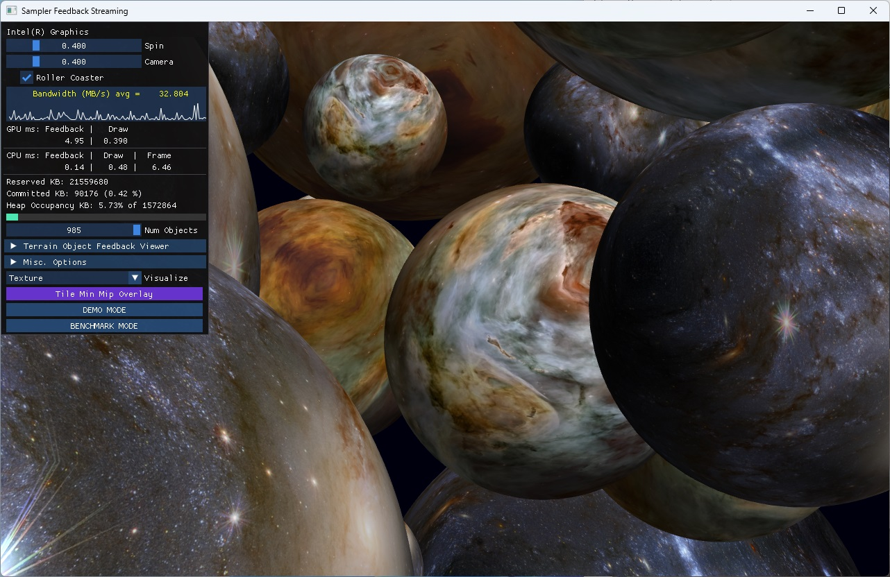

# Sampler Feedback Streaming

## Introduction

This repository contains an [MIT licensed](LICENSE) demo of _DirectX12 Sampler Feedback Streaming_, a technique using [DirectX12 Sampler Feedback](https://microsoft.github.io/DirectX-Specs/d3d/SamplerFeedback.html) to guide continuous loading and eviction of small portions (tiles) of assets allowing for much higher visual quality than previously possible by making better use of GPU memory capacity. Sampler Feedback Streaming allows scenes consisting of 100s of gigabytes of resources to be drawn on GPUs containing much less physical memory. The scene below uses just ~200MB of a 1GB heap, despite over 350GB of total texture resources. (Objects could have shared streaming resources, but the intent of the demo is to show the potential of using many unique textures).

The demo requires ***Windows 10 20H1 (aka May 2020 Update, build 19041)*** or later and a GPU with Sampler Feedback Support, such as Intel Iris Xe Graphics as found in 11th Generation Intel&reg; Core&trade; processors and discrete GPUs (driver version **[30.0.100.9667](https://downloadcenter.intel.com/product/80939/Graphics) or later**).

This repository has been updated with DirectStorage 1.0.2 for Windows&reg; from https://www.nuget.org/packages/Microsoft.Direct3D.DirectStorage/

Notes:
- The file format has changed since large textures were provided as "releases." See the [log](#log) below.
- The legacy streaming code using ReadFile() had sector alignment constraints for the file internals that are not required by DirectStorage for Windows. 

See also:

* [GDC 2021 video](https://software.intel.com/content/www/us/en/develop/events/gdc.html?videoid=6264595860001) [(alternate link)](https://www.youtube.com/watch?v=VDDbrfZucpQ) which provides an overview of Sampler Feedback and discusses this sample starting at about 15:30.

* [GDC 2021 presentation](https://software.intel.com/content/dam/develop/external/us/en/documents/pdf/july-gdc-2021-sampler-feedback-texture-space-shading-direct-storage.pdf) in PDF form


Textures derived from [Hubble Images](https://www.nasa.gov/mission_pages/hubble/multimedia/index.html), see the [Hubble Copyright](https://hubblesite.org/copyright)


Note the textures shown above, which total over 13GB, are not part of the repo. A few 16k x 16k textures are available as [release 1](https://github.com/GameTechDev/SamplerFeedbackStreaming/releases/tag/1) and  [release 2](https://github.com/GameTechDev/SamplerFeedbackStreaming/releases/tag/2)

Test textures are provided. At build time, BCx textures (BC7 and BC1 tested) in the dds/ directory are converted into the custom .XET format and placed in the ($TargetDir)/media directory (e.g. x64/Release/media)

## Build Instructions

Download the source. Build the solution file [SamplerFeedbackStreaming.sln](SamplerFeedbackStreaming.sln) (tested with Visual Studio 2019).

All executables, scripts, configurations, and media files will be found in the x64/Release or x64/Debug directories. You can run from within the Visual Studio IDE or from the command line, e.g.:

    c:\SamplerFeedbackStreaming\x64\Release> expanse.exe

By default (no command line options) there will be a single object, "terrain", which allows for exploring sampler feedback streaming. In the top right find 2 windows: on the left is the raw GPU min mip feedback, on the right is the min mip map "residency map" generated by the application. Across the bottom are the mips of the texture, with mip 0 in the bottom left. Left-click drag the terrain to see sampler feedback streaming in action.


Press the DEMO MODE button or run the batch file _demo.bat_ to see streaming in action. Press "page up" or to click _Color MinMip_ to toggle a visualization of the tiles loading, best viewed in _Roller Coaster_ mode. Note keyboard controls are inactive while the _Camera_ slider is non-zero.

    c:\SamplerFeedbackStreaming\x64\Release> demo.bat



The high-resolution textures in the first "release" package, [hubble-16k.zip](https://github.com/GameTechDev/SamplerFeedbackStreaming/releases/tag/1), work with "demo-hubble.bat", including a sky and earth. Make sure the mediadir in the batch file is set properly, or override it on the command line as follows:

    c:\SamplerFeedbackStreaming\x64\Release> demo-hubble.bat -mediadir c:\hubble-16k

## Keyboard controls

* `qwe / asd` : strafe left, forward, strafe right / rotate left, back, rotate right
* `z c` : levitate up and down
* `x` : toggles "up lock". When hovering over the "terrain" object, locking the up direction "feels right" with mouse navigation. Otherwise, it should be turned off.
* `v b` : rotate around the look direction (z axis)
* `arrow keys` : rotate left/right, pitch down/up
* `shift` : move faster
* `mouse left-click drag` : rotate view
* `page up` : toggle the min mip map viewer for the "terrain" geometry in the center of the universe
* `page down` : while camera animation is non-zero, toggles fly-through "rollercoaster" vs. fly-around "orbit"
* `space` : toggles camera animation on/off.
* `home` : toggles UI. Hold "shift" while UI is enabled to toggle mini UI mode.
* `end` : toggle overlay of min mip map onto every object
* `insert` : toggles frustum visualization
* `esc` : while windowed, exit. while full-screen, return to windowed mode

## Configuration files and command lines

For a full list of command line options, pass the command line "?", e.g.

    c:> expanse.exe ?

Most of the detailed settings for the system can be found in the default configuration file [config.json](config/config.json). You can replace this configuration with a custom configuration filewith the '-config' command line:

    -config myconfig.json

The options in the json have corresponding command lines, e.g.:

json:

    "mediaDir" : "media"

equivalent command line:

    -mediadir media

## Creating Your Own Textures

The executable `DdsToXet.exe` converts BCn DDS textures to the custom XET format. Only BC1 and BC7 textures have been tested. Usage:

    c:> ddstoxet.exe -in myfile.dds -out myfile.xet

The batch file [convert.bat](scripts/convert.bat) will read all the DDS files in one directory and write XET files to a second directory. The output directory must exist.

    c:> convert c:\myDdsFiles c:\myXetFiles

## TileUpdateManager: a library for streaming textures

The sample includes a library *TileUpdateManager* with a minimal set of APIs defined in [SamplerFeedbackStreaming.h](TileUpdateManager/SamplerFeedbackStreaming.h). The central object, *TileUpdateManager*, allows for the creation of streaming textures and heaps to contain them. These objects handle all the feedback resource creation, readback, processing, and file/IO.

The application creates a TileUpdateManager and 1 or more heaps in Scene.cpp:

```cpp
m_pTileUpdateManager = std::make_unique<TileUpdateManager>(m_device.Get(), m_commandQueue.Get(), tumDesc);

    
// create 1 or more heaps to contain our StreamingResources
for (UINT i = 0; i < m_args.m_numHeaps; i++)
{
    m_sharedHeaps.push_back(m_pTileUpdateManager->CreateStreamingHeap(m_args.m_streamingHeapSize));
}
```

Each SceneObject creates its own StreamingResource. Note **a StreamingResource can be used by multiple objects**, but this sample was designed to emphasize the ability to manage many resources and so objects are 1:1 with StreamingResources.

```cpp
m_pStreamingResource = std::unique_ptr<StreamingResource>(in_pTileUpdateManager->CreateStreamingResource(in_filename, in_pStreamingHeap));
```

# Known issues

## Performance Degradation

Performance appears to degrade over time with some non-Intel devices/drivers as exposed by the bandwidth graph in benchmark mode after a few minutes. Compare the following healthy graph to the graph containing stalls below:

- healthy: 
- stalling: 

As a workaround, try the command line `-config fragmentationWA.json` , e.g.:

    c:\SamplerFeedbackStreaming\x64\Release> demo.bat -config fragmentationWA.json
    c:\SamplerFeedbackStreaming\x64\Release> stress.bat -mediadir c:\hubble-16k -config fragmentationWA.json

The issue (which does not affect Intel GPUs) is the tile allocations in the heap becoming fragmented relative to resources. Specifically, the CPU time for [UpdateTileMappings](https://docs.microsoft.com/en-us/windows/win32/api/d3d12/nf-d3d12-id3d12commandqueue-updatetilemappings) gradually increases causing the streaming system to stall waiting for pending operations to complete. The workaround reduces fragmentation by distributing streaming resources across multiple small heaps (vs. a single large heap), which can result in visual artifacts if the small heaps fill. To mitigate the small heaps filling, more total heap memory is allocated. There may be other (unexplored) solutions, e.g. perhaps by implementing a hash in the tiled heap allocator. This workaround adjusts two properties:

    "heapSizeTiles": 512, // size for each heap. 64KB per tile * 512 tiles -> 32MB heap
    "numHeaps": 127, // number of heaps. streaming resources will be distributed among heaps

## Cracks between tiles

The demo exhibits texture cracks due to the way feedback is used. Feedback is always read *after* drawing, resulting in loads and evictions corresponding to that frame only becoming available for a future frame. That means we never have exactly the texture data we need when we draw (unless no new data is needed). Most of the time this isn't perceptible, but sometimes a fast-moving object enters the view resulting in visible artifacts.

The following image shows an exaggerated version of the problem, created by disabling streaming completely then moving the camera:


In this case, the hardware sampler is reaching across tile boundaries to perform anisotropic sampling, but encounters tiles that are not physically mapped. D3D12 Reserved Resource tiles that are not physically mapped return black to the sampler. This could be mitigated by dilating or eroding the min mip map such that there is no more than 1 mip level difference between neighboring tiles. That visual optimization is TBD.

There are also a few known bugs:
* entering full screen in a multi-gpu system moves the window to a monitor attached to the GPU by design. However, if the window starts on a different monitor, it "disappears" on the first maximization. Hit *escape* then maximize again, and it should work fine.
* full-screen while remote desktop is not borderless.

# How It Works

This implementation of Sampler Feedback Streaming uses DX12 Sampler Feedback in combination with DX12 Reserved Resources, aka Tiled Resources. A multi-threaded CPU library processes feedback from the GPU, makes decisions about which tiles to load and evict, loads data from disk storage, and submits mapping and uploading requests via GPU copy queues. There is no explicit GPU-side synchronization between the queues, so rendering frame rate is not dependent on completion of copy commands (on GPUs that support concurrent multi-queue operation) - in this sample, GPU time is mostly a function of the Sampler Feedback Resolve() operations described below. The CPU threads run continuously and asynchronously from the GPU (pausing when there's no work to do), polling fence completion states to determine when feedback is ready to process or copies and memory mapping has completed.

All the magic can be found in  the **TileUpdateManager** library (see the internal file [TileUpdateManager.h](TileUpdateManager/TileUpdateManager.h) - applications should include [SamplerFeedbackStreaming.h](TileUpdateManager/SamplerFeedbackStreaming.h)), which abstracts the creation of StreamingResources and heaps while internally managing feedback resources, file I/O, and GPU memory mapping.

The technique works as follows:

## 1. Create a Texture to be Streamed

The streaming textures are allocated as DX12 [Reserved Resources](https://docs.microsoft.com/en-us/windows/win32/api/d3d12/nf-d3d12-id3d12device-createreservedresource), which behave like [VirtualAlloc](https://docs.microsoft.com/en-us/windows/win32/api/memoryapi/nf-memoryapi-virtualalloc) in C. Each resource takes no physical GPU memory until 64KB regions of the resource are committed in 1 or more GPU [heaps](https://docs.microsoft.com/en-us/windows/win32/api/d3d12/nf-d3d12-id3d12device-createheap). The x/y dimensions of a reserved resource tile is a function of the texture format, such that it fills a 64KB GPU memory page. For example, BC7 textures have 256x256 tiles, while BC1 textures have 512x256 tiles.

In Expanse, each tiled resource corresponds to a single .XeT file on a hard drive (though multiple resources can point to the same file). The file contains dimensions and format, but also information about how to access the tiles within the file.

## 2. Create and Pair a Min-Mip Feedback Map

To use sampler feedback, we create a feedback resource corresponding to each streaming resource, with identical dimensions to record information about which texels were sampled.

For this streaming usage, we use the min mip feedback feature by [creating the resource](https://docs.microsoft.com/en-us/windows/win32/api/d3d12/nf-d3d12-id3d12device8-createcommittedresource2) with the format DXGI_FORMAT_SAMPLER_FEEDBACK_MIN_MIP_OPAQUE. We set the region size of the feedback to match the tile dimensions of the tiled resource (streaming resource) through the SamplerFeedbackRegion member of [D3D12_RESOURCE_DESC1](https://docs.microsoft.com/en-us/windows/win32/api/d3d12/ns-d3d12-d3d12_resource_desc1).

For the feedback to be written by GPU shaders (in this case, pixel shaders) the texture and feedback resources must be paired through a view created with [CreateSamplerFeedbackUnorderedAccessView](https://docs.microsoft.com/en-us/windows/win32/api/d3d12/nf-d3d12-id3d12device8-createsamplerfeedbackunorderedaccessview).

## 3. Draw Objects While Recording Feedback

For expanse, there is a "normal" non-feedback shader named [terrainPS.hlsl](src/shaders/terrainPS.hlsl) and a "feedback-enabled" version of the same shader, [terrainPS-FB.hlsl](src/shaders/terrainPS-FB.hlsl). The latter simply writes feedback using [WriteSamplerFeedback](https://microsoft.github.io/DirectX-Specs/d3d/SamplerFeedback.html) HLSL intrinsic, using the same sampler and texture coordinates, then calls the prior shader. Compare the WriteSamplerFeedback() call below to to the Sample() call above.

To add feedback to an existing shader:

1. include the original shader hlsl
2. add binding for the paired feedback resource
3. call the WriteSamplerFeedback intrinsic with the resource and sampler defined in the original shader
4. call the original shader

```cpp
#include "terrainPS.hlsl"

FeedbackTexture2D<SAMPLER_FEEDBACK_MIN_MIP> g_feedback : register(u0);

float4 psFB(VS_OUT input) : SV_TARGET0
{
    g_feedback.WriteSamplerFeedback(g_streamingTexture, g_sampler, input.tex.xy);

    return ps(input);
}
```
## 4. Process Feedback
Sampler Feedback resources are opaque, and must be *Resolved* before interpretting on the CPU.

Resolving feedback for one resource is inexpensive, but adds up when there are 1000 objects. Expanse has a configurable time limit for the amount of feedback resolved each frame. The "FB" shaders are only used for a subset of resources such that the amount of feedback produced can be resolved within the time limit. The time limit is managed by the application, not by the TileUpdateManager library, by keeping a running average of resolve time as reported by GPU timers.

As an optimization, Expanse tells streaming resources to evict all tiles if they are behind the camera. This could potentially be improved to include any object not in the view frustum.

You can find the time limit estimation, the eviction optimization, and the request to gather sampler feedback by searching [Scene.cpp](src/Scene.cpp) for the following:

- **DetermineMaxNumFeedbackResolves** determines how many resources to gather feedback for
- **QueueEviction** tell runtime to evict tiles for this resource (as soon as possible)
- **SetFeedbackEnabled** results in 2 actions:
    1. tell the runtime to collect feedback for this object via TileUpdateManager::QueueFeedback(), which results in clearing and resolving the feedback resource for this resource for this frame
    2. use the feedback-enabled pixel shader for this object

## 5. Determine Which Tiles to Load & Evict
The resolved Min mip feedback tells us the minimum mip tile that should be loaded. The min mip feedback is traversed, updating an internal reference count for each tile. If a tile previously was unused (ref count = 0), it is queued for loading from the bottom (highest mip) up. If a tile is not needed for a particular region, its ref count is decreased (from the top down). When its ref count reaches 0, it might be ready to evict.

Data structures for tracking reference count, residency state, and heap usage can be found in [StreamingResource.cpp](TileUpdateManager/StreamingResource.cpp) and [StreamingResource.h](TileUpdateManager/StreamingResource.h), look for TileMappingState. This class also has methods for interpreting the feedback buffer (ProcessFeedback) and updating the residency map (UpdateMinMipMap), which execute concurrently in separate CPU threads.

```cpp
class TileMappingState
{
public:
    // see file for method declarations
private:
    TileLayer<BYTE> m_resident;
    TileLayer<UINT32> m_refcounts;
    TileLayer<UINT32> m_heapIndices;
};
TileMappingState m_tileMappingState;
```

Tiles can only be evicted if there are no lower-mip-level tiles that depend on them, e.g. a mip 1 tile may have four mip 0 tiles "above" it in the mip hierarchy, and may only be evicted if all 4 of those tiles have also been evicted. The ref count helps us determine this dependency.

A tile also cannot be evicted if it is being used by an outstanding draw command. We prevent this by  delaying evictions a frame or two depending on swap chain buffer count (i.e. double or triple buffering). If a tile is needed before the eviction delay completes, the tile is simply rescued from the pending eviction data structure instead of being re-loaded.

The mechanics of loading, mapping, and unmapping tiles is all contained within the DataUploader class, which depends on a [FileStreamer](TileUpdateManager/FileStreamer.h) class to do the actual tile loads. The latter implementation ([FileStreamerReference](TileUpdateManager/FileStreamerReference.h)) can easily be exchanged with DirectStorage for Windows.

### 6. Update Residency Map

Because textures are only partially resident, we only want the pixel shader to sample resident portions. Sampling texels that are not physically mapped that returns 0s, resulting in undesirable visual artifacts. To prevent this, we clamp all sampling operations based on a **residency map**. The residency map is relatively tiny: for a 16k x 16k BC7 texture, which would take 350MB of GPU memory, we only need a 4KB residency map. Note that the lowest-resolution "packed" mips are loaded for all objects, so there is always something available to sample. See also [GetResourceTiling](https://docs.microsoft.com/en-us/windows/win32/api/d3d12/nf-d3d12-id3d12device-getresourcetiling).

When a texture tile has been loaded or evicted by TileUpdateManager, it updates the corresponding residency map. The residency map is an application-generated representation of the minimum mip available for each region in the texture, and is described in the [Sample Feedback spec](https://microsoft.github.io/DirectX-Specs/d3d/SamplerFeedback.html) as follows:

```
The MinMip map represents per-region mip level clamping values for the tiled texture; it represents what is actually loaded.
```

Below, the Visualization mode was set to "Color = Mip" and labels were added. TileUpdateManager processes the Min Mip Feedback (left window in top right), uploads and evicts tiles to form a Residency map, which is a proper min-mip-map (right window in top right). The contents of memory can be seen in the partially resident mips along the bottom (black is not resident). The last 3 mip levels are never evicted because they are packed mips (all fit within a 64KB tile). In this visualization mode, the colors of the texture on the bottom correspond to the colors of the visualization windows in the top right. Notice how the resident tiles do not exactly match what feedback says is required.
")

To reduce GPU memory, a single combined buffer contains all the residency maps for all the resources. The pixel shader samples the corresponding residency map to clamp the sampling function to the minimum available texture data available, thereby avoiding sampling tiles that have not been mapped.

We can see the lookup into the residency map in the pixel shader [terrainPS.hlsl](src/shaders/terrainPS.hlsl). Resources are defined at the top of the shader, including the reserved (tiled) resource g_streamingTexture, the residency map g_minmipmap, and the sampler:

```cpp
Texture2D g_streamingTexture : register(t0);
Buffer<uint> g_minmipmap: register(t1);
SamplerState g_sampler : register(s0);
```

The shader offsets into its region of the residency map (g_minmipmapOffset) and loads the minimum mip value for the region to be sampled.

```cpp
    int2 uv = input.tex * g_minmipmapDim;
    uint index = g_minmipmapOffset + uv.x + (uv.y * g_minmipmapDim.x);
    uint mipLevel = g_minmipmap.Load(index);
```

The sampling operation is clamped to the minimum mip resident (mipLevel).

```cpp
    float3 color = g_streamingTexture.Sample(g_sampler, input.tex, 0, mipLevel).rgb;
```

## 7. Putting it all Together

There is some work that needs to be done before drawing objects that use feedback (clearing feedback resources), and some work that needs to be done after (resolving feedback resources). TileUpdateManager creates theses commands, but does not execute them. Each frame, these command lists must be built and submitted with application draw commands, which you can find just before the call to Present() in [Scene.cpp](src/Scene.cpp) as follows:

```cpp
auto commandLists = m_pTileUpdateManager->EndFrame();

ID3D12CommandList* pCommandLists[] = { commandLists.m_beforeDrawCommands, m_commandList.Get(), commandLists.m_afterDrawCommands };
        m_commandQueue->ExecuteCommandLists(_countof(pCommandLists), pCommandLists);
```

## Log

- 2022-06-10: File format (.xet) change. DdsToXet can upgrade old Xet files to the new format. Assets in the DDS directory are exported at build time into media directory. Upgrade to DirectStorage v1.0.2. Many misc. improvements.
- 2022-05-05: Workaround for rare race condition. Many tweaks and improvements.
- 2022-03-14: DirectStorage 1.0.0 integrated into mainline
- 2021-12-15: "-addAliasingBarriers" command line option to add an aliasing barrier to assist PIX analysis. Can also be enabled in config.json.
- 2021-12-03: added BC1 asset collection as "release 2." All texture assets (.xet files) can reside in the same directory despite format differences, and can co-exist in the same GPU heap. Also minor source tweaks, including fix to not cull base "terrain" object.
- 2021-10-21: code refactor to improve sampler feedback streaming library API
- 2021-08-10: Added some 16k x 16k textures (BC7 format) posted as "release 1".

## License

Sample and its code provided under MIT license, please see [LICENSE](/LICENSE). All third-party source code provided under their own respective and MIT-compatible Open Source licenses.

Copyright (C) 2021, Intel Corporation  
